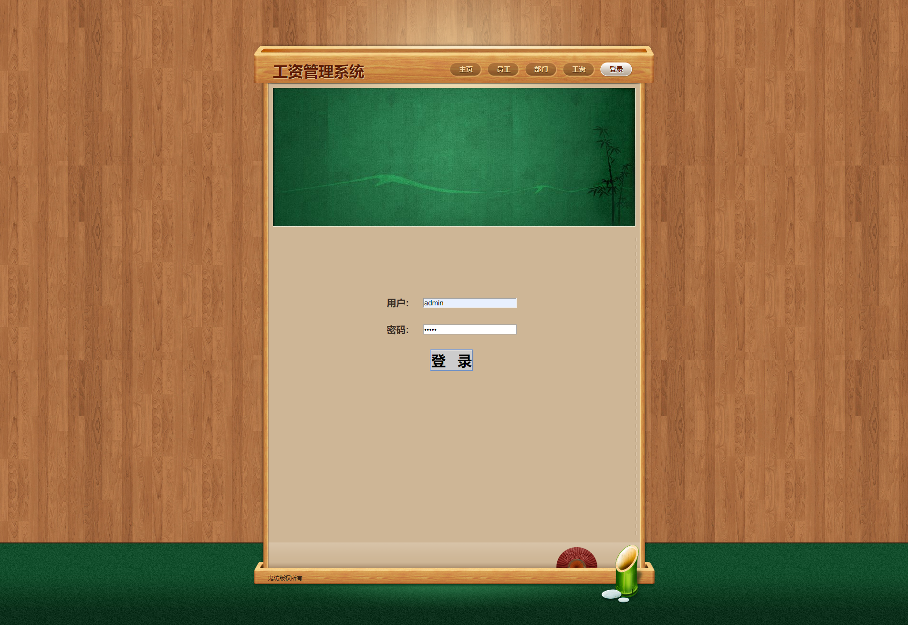
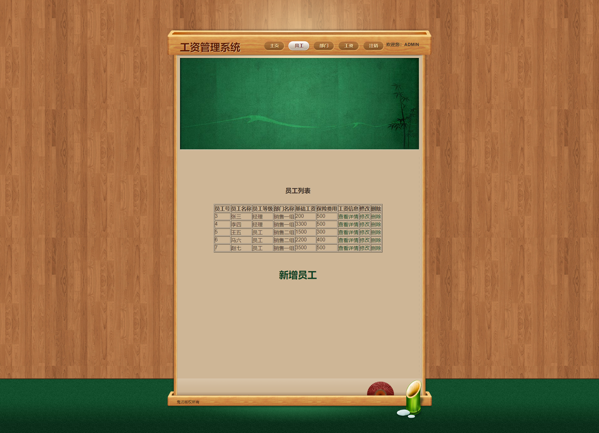
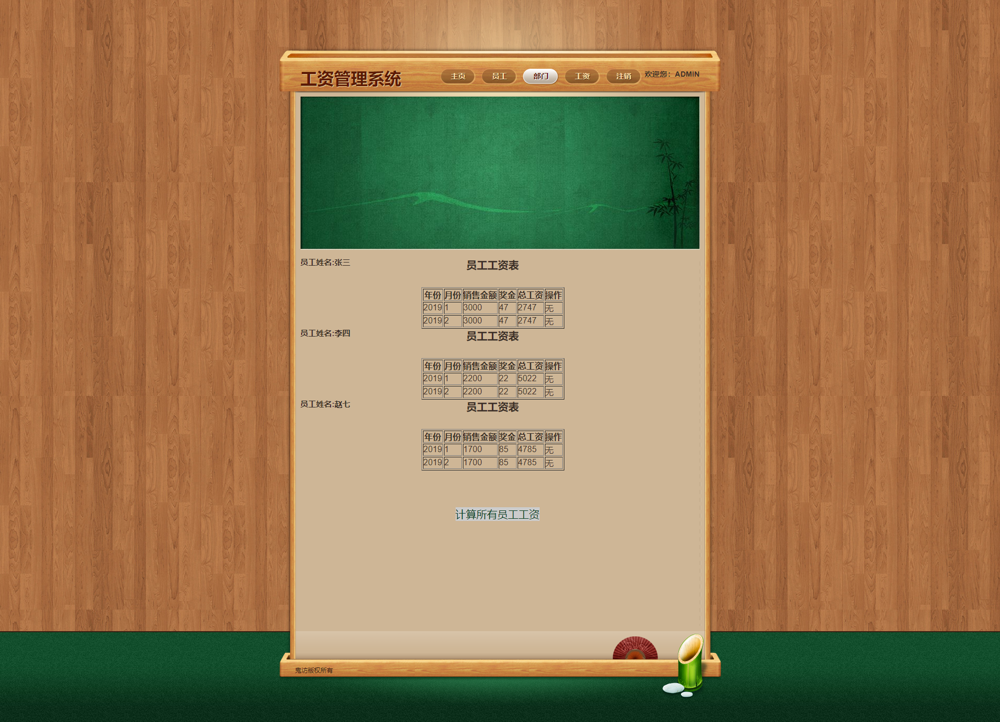
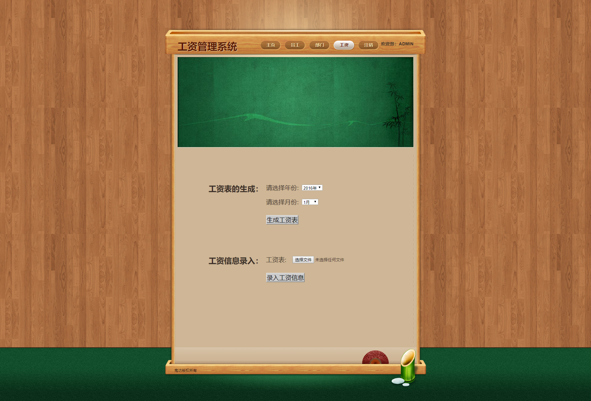

# 简易工资管理系统

**作者：积极向上小木木 &nbsp;&nbsp;&nbsp;&nbsp;&nbsp;&nbsp;&nbsp; 联系方式：PositiveMumu@126.com**

*基于JSP+Servlet的简易的工资管理系统*

## 一、项目功能

1. 增删改员工个人信息。
2. 查看员工工资信息。
3. 增删改部门信息。
4. 查看部门信息。
5. 查看部门下所有员工的工资信息。
6. 计算个人工资信息。
7. 计算部门工资信息。
8. 依据Excel表录员工工资信息。
9. 生成某年某月工资表。

## 二、项目信息

1. 项目使用IDEA_2018.3.5开发。
2. JDK版本为1.8_211。
3. Tomcat版本为8.5.45。
4. 数据库使用Mysql，版本为5.7。

## 三、项目还原设置

1. 将SalaryManagerSystem.sql还原至数据库中。
2. 修改SalaryManagerSystem/src/c3p0-config.xml文件：
   1. jdbcUrl修改为自己的数据库连接字符串。
   2. user修改为自己的用户名。
   3. password修改为自己的密码。
3. 运行即可。

## 四、项目运行注意事项：

1. 只有管理员可以登录。账号为admin，密码为admin。
2. 在未登录时，可以查看各种信息，但是无法修改。也无法录入工资信息以及生成工资表。
3. 登录获得权限后可以进行增删改操作。
4. 录入的工资信息是一个Excel文件，具体格式见salary.xlsx。
5. 工资的计算方式是：
   1. 工资=销售金额+基础工资+奖金-保险。
   2. 普通员工奖金为销售额的5%。
   3. 部门经理的奖金为部门总销售额的1%。
   4. 12月份时会加入个人年销售额的1%作为年终奖金。
6. 生成工资表时如果选择的年份及月份工资信息未录入，则无法生成工资表。
7. 生成工资表时如果选择的年份及月份工资信息未计算，则生成工资表会有错误。

## 五、项目截图

1. 主界面：

2. 登录界面：

3. 员工信息管理界面：

4. 员工信息详情界面：

5. 部门信息管理界面：

6. 部门信息详情界面：

7. 录入与生成工资表页面：

